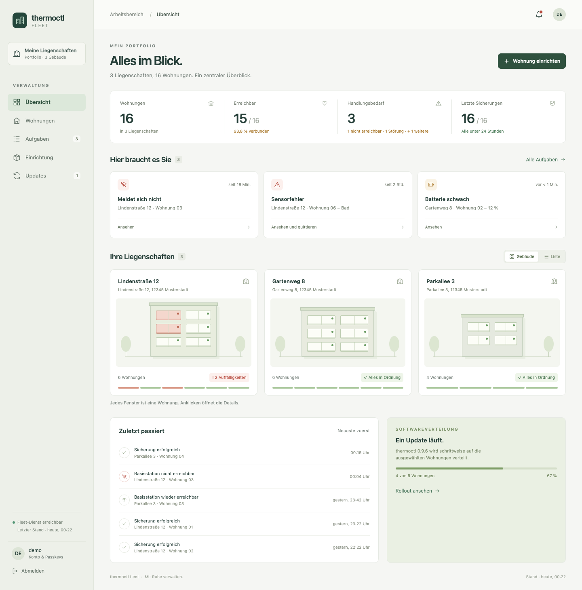
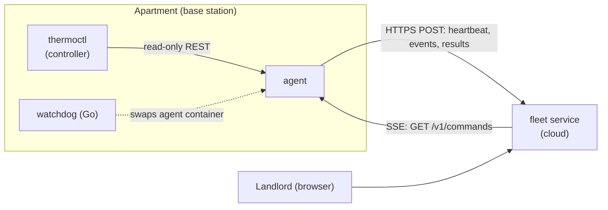
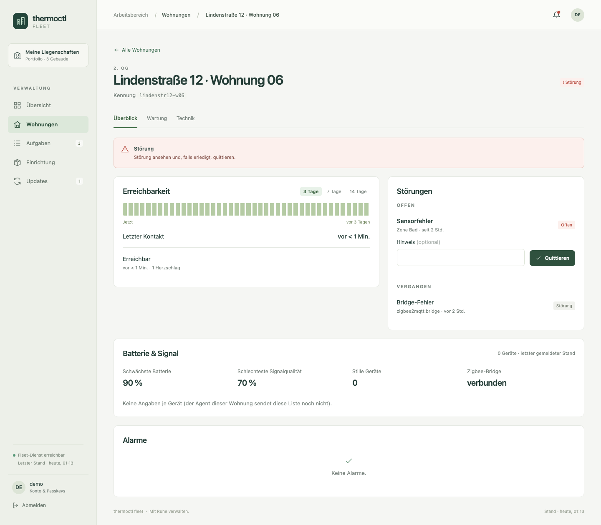
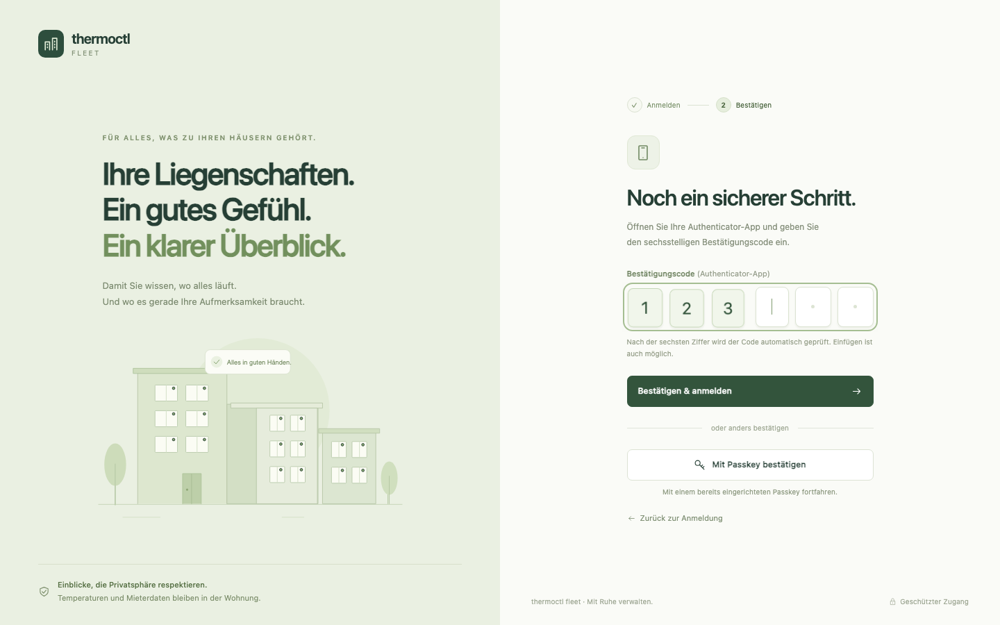
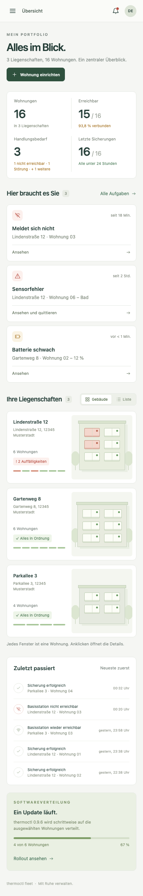

<div align="center">

<picture>
  <source media="(prefers-color-scheme: dark)" srcset="branding/renders/thermoctl-fleet-icon-Dark-1024.png">
  
</picture>

# thermoctl-fleet

**The landlord's overview across all apartments: health, faults, and an alarm when a heartbeat goes missing.**

[](https://github.com/MagicalWig34653/thermoctl-fleet/actions/workflows/ci.yml)
[](https://magicalwig34653.github.io/thermoctl-fleet/)
[](LICENSE)
[](pyproject.toml)

[Website](https://magicalwig34653.github.io/thermoctl-fleet/) ·
[Dokumentation](https://magicalwig34653.github.io/thermoctl-fleet/docs.html) ·
[Interaktive Demo](https://magicalwig34653.github.io/thermoctl-fleet/demo/)

<br>



</div>

> The website and the documentation are in German; this README is in English.
> The screenshots show the real UI against a locally seeded demo fleet, with
> fictitious data.

## What is it?

`thermoctl-fleet` is a small cloud service for landlords who run several
[`thermoctl`](../thermoctl) installations. Every apartment sends a heartbeat
with health data; the service collects faults, **raises an alarm when a
heartbeat is missing**, and can send a short, closed list of maintenance
commands to the apartment.

`thermoctl` stays a standalone, self-hostable single-apartment product and
works fully without this service. The two never talk directly: a very small
**agent** on each apartment's base station queries thermoctl only through its
existing read-only REST interface and is the only component that talks to the
cloud.

### What it is not

- **Not a second controller.** Setpoints, schedules, frost protection, and
  arming stay in the apartment. The cloud cannot change them: the command does
  not exist.
- **Not a data collector.** Room temperatures, setpoints, schedules, absence
  periods, tenant names, and contact details are never transmitted.
- **Not a replacement for the apartment view.** The tenant never sees the
  cloud.

The full reasoning is in [`docs/specification.md`](docs/specification.md),
which is the authoritative source for this project.

## Features

- **Heartbeat monitoring.** One health report per apartment every 120 seconds;
  alarms on the *absence* of a heartbeat, not only on reported faults.
- **Fault collection.** Open faults, battery and signal values across all
  apartments in one overview, with acknowledgement.
- **Closed command list.** Five stage-1 maintenance commands (`report_now`,
  `fetch_logs`, `backup_now`, `agent_restart`, `diagnostic_bundle`), each with
  an id, an expiry, and a local log entry in the apartment.
- **Outbound-only connection.** HTTPS upstream, Server-Sent Events downstream;
  no port forwarding in the tenant's router, no MQTT over the internet.
- **Device registration.** One-time registration code, certificate
  fingerprint pinning, and a verification code confirmed in the UI.
- **Encrypted backups.** Operational data is encrypted on the device before
  upload; the cloud stores only an opaque block.
- **Careful sign-in.** Password plus TOTP, optional passkeys (WebAuthn),
  lockout and per-IP throttling; accounts are created only on the server's
  command line.
- **Prepared base-station images** and a flash tool (terminal UI and CLI) for
  Raspberry Pi and amd64 mini PCs.

## How it works



The **agent is the security boundary**, not the cloud: it decides locally
whether a command is executed at all (id already seen, expiry exceeded,
precondition met). The **watchdog** only swaps between two already present,
already verified container images and has no network access.

The repository holds both Docker images, the watchdog, and the system image
recipe because all of them are tightly coupled through one contract: the
Pydantic models in [`protocol/`](protocol/) are imported by both the cloud and
the agent, which makes contract tests possible.

<details>
<summary><b>Screenshots</b></summary>
<br>

| Apartment detail | Sign-in with 2FA | Overview on a phone |
|---|---|---|
|  |  |  |

</details>

## Quick start

Requires Python 3.13 or newer.

### Run the fleet UI locally

```bash
python3.13 -m venv .venv && .venv/bin/pip install -e ".[dev,fleet,agent,flash,docs]"
.venv/bin/python -m tools.dev_fleet
```

The launcher creates a private, gitignored `.dev/` database with a demo login
and TOTP key, prints the login, and serves the UI on `localhost:8000`. Use
`--reset` (with `--yes` to skip the prompt) to recreate the state, `--port` to
change the port, and `--no-reload` to disable source watching.

Alternatively, run the bare service (no database, no authentication; see
[`docs/STATUS.md`](docs/STATUS.md)):

```bash
.venv/bin/uvicorn fleet.app:app --reload
```

### Docker

Two independent images come from one repository:

```bash
docker build -f docker/Dockerfile.fleet -t thermoctl-fleet .
docker build -f docker/Dockerfile.agent -t thermoctl-agent .
docker run -d --name fleet --env-file .env -p 127.0.0.1:8100:8000 thermoctl-fleet
```

[`docker/compose.example.yml`](docker/compose.example.yml) illustrates how the
two fit together. It is not a rollout recipe: the agent runs on each
apartment's base station, not next to the fleet service. Keep your own values
in a local `.env` that is never committed.

<details>
<summary><b>Operating the fleet service: accounts and configuration</b></summary>
<br>

Accounts are created only on the server, never through the web UI. The
password is prompted interactively; `FLEET_DATABASE_URL` and `FLEET_TOTP_KEY`
must be set.

```bash
python -m fleet.admin create-user alice
```

Required for operation:

| Variable | Purpose |
|---|---|
| `FLEET_DATABASE_URL` | SQLAlchemy connection string of the database |
| `FLEET_TOTP_KEY` | Key under which accounts' TOTP secrets are stored encrypted |
| `FLEET_WEBAUTHN_RP_ID`, `FLEET_WEBAUTHN_ORIGIN`, `FLEET_WEBAUTHN_RP_NAME` | Passkey (WebAuthn) relying party |
| `FLEET_PUBLIC_URL` | Public address, written into the generated `agent-registration.json` |
| `FLEET_CERT_FINGERPRINT` | SHA-256 fingerprint of the server certificate (`sha256:<64 hex>`) that agents pin |

Many further optional variables (alarm interval, retention periods, session
and lockout behaviour, registration throttling, SMTP/webhook alerts,
`FLEET_UI_PASSWORDLESS_NETWORKS`, ...) are described, derived from the source,
in the
[documentation chapter on running the service](https://magicalwig34653.github.io/thermoctl-fleet/docs.html#server).
TLS cannot be switched off; usually a reverse proxy terminates it.

</details>

### Flash a base station

Terminal UI (German interface; guides through image, disk, settings,
confirmation, writing, read-back, and boot files):

```bash
python -m tools.flash_tui
```

Or the CLI. Show the eligible disks, do a dry run, then verify what was
written:

```bash
python -m tools.flash_image list-disks
python -m tools.flash_image flash \
  --image thermoctl-base-station.img.xz --disk /dev/disk4 \
  --fleet-address https://fleet.example.invalid \
  --certificate-fingerprint sha256:<64 hex characters> \
  --registration-code <registration code from the fleet UI> \
  --dry-run
python -m tools.flash_image verify --disk /dev/disk4 --image thermoctl-base-station.img.xz
```

Drop `--dry-run` to write for real. Optional: `--backup-recipient` (a public
age recipient, repeatable), `--wifi-ssid` and `--wifi-password`,
`--boot-mount-point`. The tool offers only external, physical disks and
**erases the target**; disks over 256 GB additionally need `--allow-large-disk`.
`--yes` skips the typed confirmation only together with
`--i-know-this-erases-the-disk`.

### Test enrollment without hardware (Mac)

An Apple Silicon Mac, [Lima](https://lima-vm.io), and QEMU are enough to run
the whole registration flow against a locally started fleet service. The VM
uses a locally built agent image, so the real watchdog digest swap is **not**
exercised.

```bash
brew install lima qemu
tools/mac-test-vm create
tools/mac-test-vm start
tools/mac-test-vm enroll     # confirm the device in the UI, then:
tools/mac-test-vm finish
tools/mac-test-vm logs       # also: status, ssh, stop, delete --yes
```

## Security principles

These six points are not up for renegotiation; see [`CLAUDE.md`](CLAUDE.md)
and the specification.

1. **The command list is closed.** A new `CommandType` extends what a
   compromised fleet server could do to an apartment; stage 2 needs the
   owner's explicit approval.
2. **Image sources are hard-coded in the agent.** The cloud names version and
   digest, never the source; no digest, no start.
3. **No private keys in the cloud.** WireGuard and device keys are generated on
   the base station; the cloud sees public keys only.
4. **No tenant data in plain text in the cloud.** Operational backups are
   encrypted on the device; the cloud never holds the key.
5. **The agent is the security boundary.** Command checks live in `agent/` and
   are enforced there, whatever the cloud says.
6. **The watchdog knows no network and no registry,** and its `go.mod` stays
   free of dependencies.

## Repository layout

| Path | Contents |
|---|---|
| [`fleet/`](fleet/) | Cloud service (FastAPI): heartbeats and events, SSE command output, web UI |
| [`agent/`](agent/) | Agent on the base station: heartbeats, command execution, desired-state reconciliation, backup |
| [`protocol/`](protocol/) | Shared Pydantic models, the contract between both sides |
| [`watchdog/`](watchdog/) | Go module without dependencies; swaps the agent container; no Docker image |
| [`image/`](image/) | Recipe for the prepared base-station images (Raspberry Pi OS, Debian 13) |
| [`tools/`](tools/) | Dev server, flash tool, screenshots, image check, Mac test VM |
| [`docker/`](docker/) | `Dockerfile.fleet`, `Dockerfile.agent`, example compose file |
| [`site/`](site/) | GitHub Pages website, documentation, and click demo (plain HTML/CSS/JS) |
| [`branding/`](branding/) | App icon (Icon Composer bundle) and renders |
| [`docs/`](docs/) | [Specification](docs/specification.md) and [`STATUS.md`](docs/STATUS.md) |
| [`tests/`](tests/) | Test suite, including contract tests across both sides |

## Development

```bash
.venv/bin/python -m pytest
.venv/bin/ruff check .
.venv/bin/mypy protocol fleet agent tools
(cd watchdog && go vet ./... && go test ./...)
```

Use `python -m pytest` rather than the `.venv/bin/pytest` console script: with
an editable install on macOS the script does not reliably find the package.

CI ([`ci.yml`](.github/workflows/ci.yml)) runs ruff, mypy, and pytest on
Python 3.13 and 3.14 and builds both Docker images; the watchdog, image, and
Pages workflows are separate.

<details>
<summary><b>PyCharm run configurations</b></summary>
<br>

Open the repository with the project interpreter and use the shared `.run/`
configurations (grouped in PyCharm; names are German):

- **Fleet:** dev server with demo data, reset the dev server.
- **Tests:** all (with coverage), fast (without coverage).
- **Checks:** Ruff, Mypy, image configuration check, watchdog Go tests.
- **Tools:** flash tool (terminal UI), flash tool disk listing, website
  screenshots, serve the website locally.
- **Mac test VM:** status, create, start, enroll, logs, stop.

</details>

## Project status

This is a scaffold under active development, not a finished product. The
current state and every open point are tracked in
[`docs/STATUS.md`](docs/STATUS.md). Known open points:

- The flash tool has **not been tested on real hardware**; the Windows backend
  in particular is untested, and the Linux path still needs a hardware test
  with expendable media.
- The amd64 image still needs an end-to-end boot test.
- Container update execution is **disabled** for now.
- Stage-2 commands (for example `service_restart`, `apply_update`,
  `factory_reset`, `open_access`) are not available on the command channel and
  need the owner's approval after a heating season of operational experience.

## Contributing

Please read [`CLAUDE.md`](CLAUDE.md) first, in particular the scope limits and
the six security principles. Changes touching them need explicit approval from
the project owner. Every endpoint and function gets a real test; `ruff`, `mypy`,
and `pytest` must pass. Never commit secrets, apartment ids, or addresses.

## License

Licensed under the [GNU Affero General Public License, version 3](LICENSE)
(AGPL-3.0-only), like `thermoctl`.
