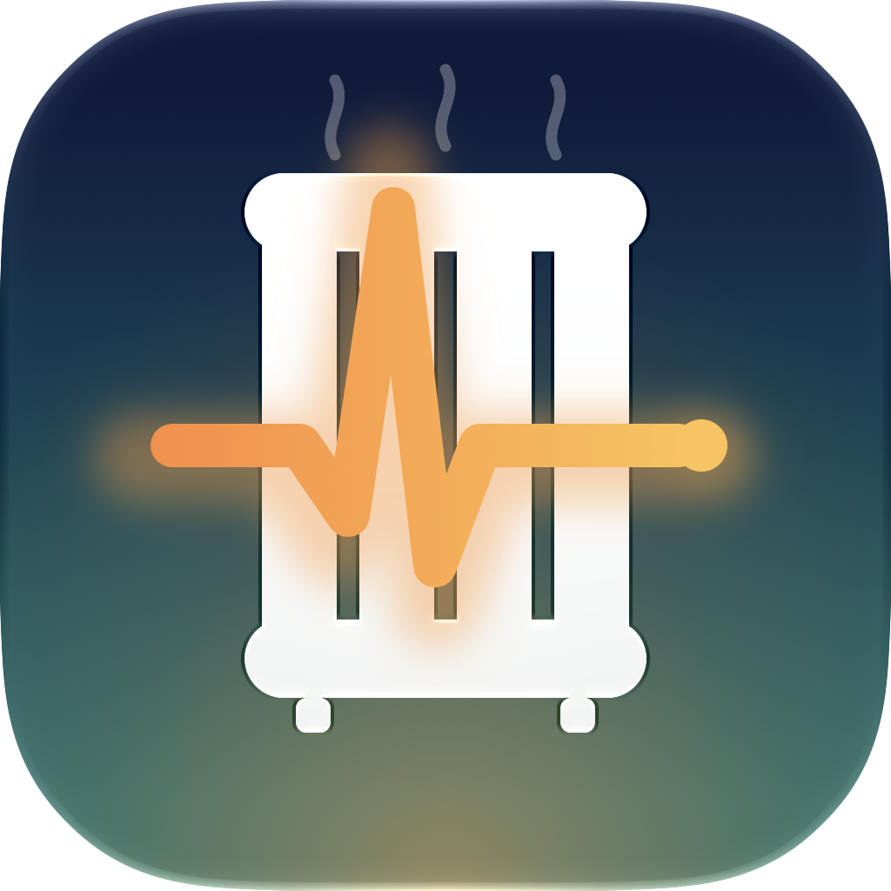
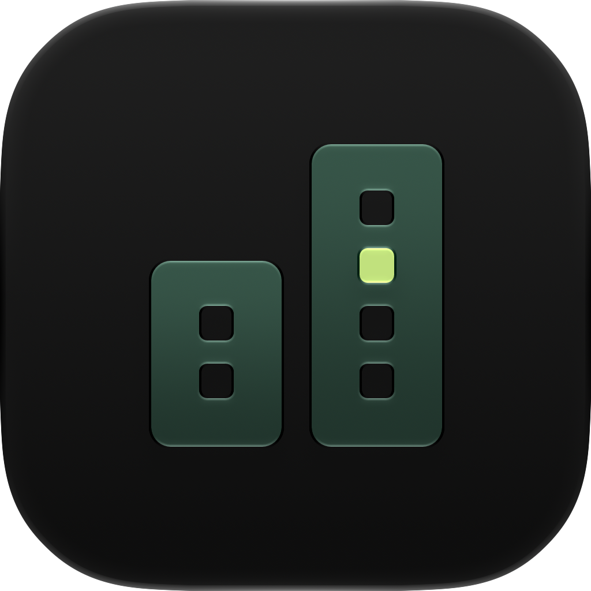

# thermoctl-fleet


A small cloud service for landlords with several [`thermoctl`](../thermoctl)
installations: it receives a heartbeat with health data from every
apartment, collects faults, alarms on **absence** of a heartbeat, and can
send a short, closed list of maintenance commands to an apartment. It is
**not a second controller** -- setpoints, schedules, and arming stay in the
apartment -- and **not a data collector**: room temperatures, setpoints, and
tenant data are not transmitted. The full reasoning for this scope is in
[`docs/specification.md`](docs/specification.md).

## Relationship to thermoctl

`thermoctl` stays a standalone, self-hostable single-apartment product and
works fully without this service. `thermoctl-fleet` does not talk to
`thermoctl` directly: a separate, very small program runs on each
apartment's base station, the **agent** (`agent/`), which queries thermoctl
exclusively through its existing, read-only REST interface and is the only
thing that talks to the cloud. This separation is deliberate, not
incidental: the agent is the security boundary -- it decides locally which
commands it executes at all, regardless of whether the cloud has been
compromised.

## One repository, two images

`thermoctl-fleet` ships **two** independent Docker images from **one**
repository: `fleet/` (the cloud service) and `agent/` (the agent). They run
on different hardware, at different operators, with different lifecycles --
and still live in one repository, because they are tightly coupled via a
shared protocol: the heartbeat schema, the closed command list, and the
desired-state format for an apartment's four containers. These contracts
live as Pydantic models in [`protocol/`](protocol/) and are imported by both
sides.

Separate repositories would inevitably duplicate these contracts -- once in
`fleet`, once in `agent`, with no tool enforcing that they match -- and
would make contract tests impossible: [`tests/`](tests/) checks, among other
things, that an example heartbeat from the specification is accepted by
exactly the same model that the cloud side also accepts. That requires both
sides to import the same module, not two copies of it.

Two further parts in the same repository, for the same reason, but without
their own Docker image:

- **[`watchdog/`](watchdog/)** -- written in Go, not in Python: it is the
  one thing on the device that has to work when everything else is broken,
  and a statically linked binary does not know the classes of failure
  (a broken interpreter, a half-applied system update) that can disable a
  Python process. It shares a line-based state file with the agent (not
  JSON, so it stays readable in every language with built-in tools) --
  `watchdog/check_contract.sh` checks this contract across languages:
  Python writes, the built Go binary reads.
- **[`image/`](image/)** -- the recipe for the base station's prepared
  system images (Raspberry Pi OS or Debian, both 64-bit). No custom
  operating system, just a package list, units, and configuration on top of
  plain Debian.

## Layout

```
fleet/       Cloud service (FastAPI): heartbeat and event receipt, SSE command output
agent/       Agent on the base station: sending heartbeats, executing commands,
             desired-state reconciliation, backup
protocol/    Shared Pydantic models -- the actual contract between both sides
watchdog/    Go module: swaps the agent container, no Docker image
image/       Recipe for the prepared system images (Raspberry Pi OS, Debian)
tools/       Build/CI tooling, among other things the check of the image/ configuration
docs/        Specification (adopted unchanged) and STATUS.md
```

**Status:** this is a scaffold, not a finished application. Every missing
piece in `fleet/`, `agent/`, and `watchdog/` carries a reference to the
relevant section of the specification (`NotImplementedError` in Python, an
error value referencing the section in Go). The current status and open
points are in [`docs/STATUS.md`](docs/STATUS.md).

## Running locally

```bash
python3.13 -m venv .venv && .venv/bin/pip install -e ".[dev,fleet,agent,flash,docs]"
.venv/bin/python -m pytest
```

`python -m pytest` instead of `.venv/bin/pytest`: the console script under
`.venv/bin` does not work reliably with an editable install on macOS --
the same cause thermoctl's README names for its own console command (the
file that makes the package discoverable there is marked hidden and skipped
at startup). `python -m pytest` instead takes the project directory into
the module path in the regular way.

Run the cloud service against itself (without a database, without
authentication -- see `docs/STATUS.md`):

```bash
.venv/bin/uvicorn fleet.app:app --reload
```

An example interplay of both images via Docker Compose is in
[`docker/compose.example.yml`](docker/compose.example.yml).

Check the watchdog (own toolchain, see
[`watchdog/README.md`](watchdog/README.md)):

```bash
cd watchdog && go vet ./... && go test ./...
```

## Entwickeln mit PyCharm

Open the repository with the project interpreter and use the shared `.run/`
configurations (grouped in PyCharm):

- **Fleet:** `Fleet – Dev-Server (Demo-Daten)`, `Fleet – Dev-Server zurücksetzen`.
  The launcher creates a private, gitignored `.dev/` database, demo login,
  and TOTP key, then prints the login and serves the UI on localhost:8000.
- **Tests:** `Tests – alle`, `Tests – schnell (ohne Coverage)`.
- **Prüfungen:** `Ruff`, `Mypy`, `Image-Konfiguration prüfen`, `Watchdog – Go-Tests`.
- **Werkzeuge:** `Flash-Tool (Terminal-Oberfläche)`, `Flash-Tool – Laufwerke anzeigen`,
  `Website-Screenshots erzeugen`, `Website lokal ansehen`.
- **Mac-Test-VM:** `Status`, `Erstellen`, `Starten`, `Registrieren`, `Logs`, `Stoppen`.

The same local fleet starts outside PyCharm with `python -m tools.dev_fleet`.
Use `--reset` to recreate it and `--no-reload` to disable source watching.

## Documentation website

A German-language website and documentation for landlords/operators --
landing page, an eight-chapter illustrated documentation (running the fleet
service, adding the first apartment, daily operation, maintenance, the
architecture, the security model, FAQ), and a static click demo with
fictitious data -- lives under [`site/`](site/) (plain HTML/CSS/JS, no build
step, no external fonts or CDNs) and is published via GitHub Pages at
**<https://magicalwig34653.github.io/thermoctl-fleet/>**
(deployed by [`.github/workflows/pages.yml`](.github/workflows/pages.yml) on
every push to `main` that touches `site/**`). Its screenshots are the real UI
captured against a throwaway, locally seeded demo fleet by
[`tools/docs_screenshots.py`](tools/docs_screenshots.py) -- reproducible, no
real apartment or tenant data -- and cropped to `site/assets/img/`.

The site's favicon is the fleet UI's own mark,
[`fleet/static/ui/favicon.svg`](fleet/static/ui/favicon.svg) (a copy lives in
`site/assets/icon/`, next to its PNG `apple-touch-icon`).

The app icon lives at [`branding/thermoctl-fleet.icon`](branding/thermoctl-fleet.icon)
(an Xcode Icon Composer bundle: a thermometer whose scale is the fleet --
four glass segments, warm at the bottom and cool at the top, rising from a
warm bulb).
Rendered with Icon Composer's own `ictool` (`Default`/`Dark`/`ClearLight`
renditions, `branding/renders/`):

<p>
  
  
  
</p>

## License

`thermoctl-fleet`, like `thermoctl`, is licensed under the
[GNU Affero General Public License, Version 3](LICENSE) (AGPL-3.0-only).
